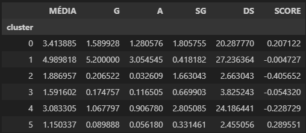

# Agrupamento de dados do Cartola FC

## Índice

1. Introdução
2. Estrutura do repositório
3. Funcionamento
4. Outras aplicações

Repositório destinado aos códigos de ETL (extração, tratamento e carregamento) de bases de dados do Cartola FC.

## 1 Introdução

Os códigos deste repositório têm como objetivo fazer a coleta de dados do Cartola FC e agrupá-los usando o K-Means.
Após o agrupamento, o intuito é tirar conclusões que ajudem na escalação do time em cada rodada.

## 2 Estrutura do repositório

* etl_cartola.py: contém classes e métodos usados na coleta dos dados do Cartola FC
* times.csv: contém uma tabela com os 20 times da Série A do campeonato brasileiro com as probabilidades de vitória, derrota e empate em alguma rodada específica do campeonato, além da coluna score = prob_vitoria - prob_derrota.
* agrupamento.ipynb: arquivo onde o usuário preencherá parâmetros necessários e poderá visualizar os resultados do agrupamento

## 3 Funcionamento

Primeiramente, foi feita a coleta de dados dos jogadores do Cartola FC. Essa coleta foi feita por meio da API do Cartola FC. Os dados que puderam ser obtidos envolvem:

    * Nome do jogador
    * Apelido do jogador
    * Posição do jogador
    * Time do jogador
    * Scouts: gols, assistências, finalizações, desarmes, SG's defesas etc. Todos os scouts do Cartola FC.
    * Scouts (mandante)
    * Scouts (visitante)
    * Média dos scouts: média de todos os scouts por partida.
    * Média dos scouts (mandante)
    * Média dos scouts (visitante)

A cada rodada em aberto, o Cartola FC disponibiliza esses dados referentes à rodada atual do Campeonato Brasileiro. No meu caso, fiz a coleta dos dados da rodada 33.

Sobre os times, foram utilizados dados referentes à rodada atual:

* Percentual de vitória
* Percentual de empate
* Percentual de derrota
* Score = % vitória - % derrota

Ou seja, obtemos dados dos jogadores e seus times.

Em seguida, foi feita uma redução de dimensionalidade nesses dados usando Principal Component Analysis (PCA) para que os dados fiquem com 2 dimensões.

Os dados do PCA foram enviados ao K-Means, que convergiu com 25 iterações.

Por último, foi analisada uma tabela com medidas de tencência central de cada cluster:

Com base nisso, foi feita uma interpretação manual dos resultados, de onde foi possível identificar o perfil de cada cluster:

* **Cluster 0:** jogadores bons dos times favoritos da rodada
* **Cluster 1:** meias, atacantes e laterais mais ofensivos com as maiores médias
* **Cluster 2:** jogadores dos times "desfavoritos" da rodada
* **Cluster 3:** cluster misto
* **Cluster 4:** jogadores com maiores números de SG e desarmes
* **Cluster 5:** jogadores ruins e técnicos dos times favoritos da rodada

## 4 Outras aplicações

O agrupamento pode ser utilizado em diversos contextos, no próprio contexto do futebol, o agrupamento de jogadores com base em características físicas pode ajudar os membros equipe de preparação física a agrupar jogadores com necessidades físicas semelhantes para passar treinos personalizados para cada grupo.

No contexto bancário, o agrupamento em bases de dados de clientes é feito com o objetivo de selecionar grupos de clientes com perfis financeiros semelhantes, por exemplo:

* Grupo 1: clientes com renegociação vigente com atraso <= 30 dias
* Grupo 2: clientes com renegociação vigente com atraso > 30 dias
* Grupo 3: clientes com algum produto bancário contratado sem atraso no pagamento
* Grupo 4: clientes com algum produto bancário contratado com atraso no pagamento

Obviamente que em alguns contextos os grupos podem ser criados simplesmente fazendo filtros na base de dados. Por exemplo, se quero os jogadores com maior média do Cartola FC, posso simplesmente ordená-los pela média decrescente e selecionar os primeiros. Se quero clientes com renegociação ativa sem atraso posso simplesmente filtrar isso na minha base.

Porém, o agrupamento ajuda em 2 tarefas:

* Escolher em QUANTOS grupos o agrupamento será feito
* Escolher QUAIS serão os grupos - e isso é extremamente útil, pois muitas vezes são criados grupos com base em combinações de características que não havíamos explorado.

Ou seja: deixe o algoritmo encontrar padrões nos dados e depois interprete-os e tome decisões.

